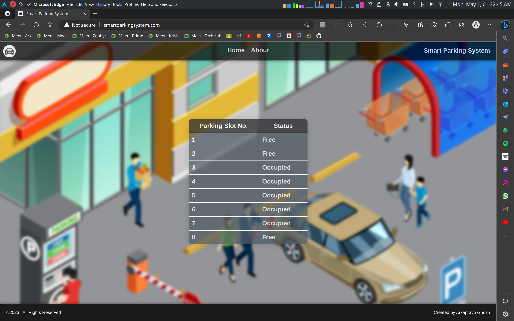

# Smart Parking System

# Model Image

    

# Description
This is a Smart Parking System that has capabilities to dynamically detect the number of available parking slots in a parking lot based on a config file and show status of the slots through a website by using IR Sensors. The system is built using Raspberry Pi, Node JS, Express JS, and React JS.

# Web UI

    

<iframe
    width="640"
    height="480"
    src="https://www.youtube.com/embed/g6361kz4cL4"
    frameborder="0"
    allow="autoplay; encrypted-media"
    allowfullscreen
>
</iframe>

# Installation
Installation Guide can be found [here](docs/INSTALLATION.md).
