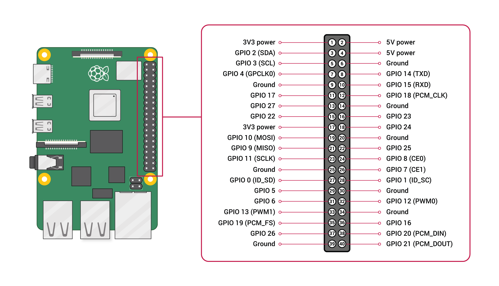

# Installation

## Prerequisites

- Raspberry Pi 3 Model B or higher
- Debian-based OS (Raspberry Pi OS, Ubuntu, DietPi, etc.)
- NodeJS LTS Hydrogen (v18.16.0)

## Installation Steps
- [Backend](INSTALLATION.md#backend)
- [Frontend](INSTALLATION.md#frontend)
## Backend
> **Note:** This is required to be run on the Raspberry Pi. Root privileges are necessary for all the steps.

- Open Root Shell
```bash
sudo -i
```

- Clone this repository
```bash
git clone https://github.com/Arkapravo-Ghosh/Smart-Parking-System.git
```
- Navigate to the server directory
```bash
cd Smart-Parking-System/src/server
```
- Edit `/etc/sps-pins.conf` to configure the pins
```bash
nano /etc/sps-pins.conf
```
The file should look like this:
```
15
16
```
> **NOTE:** This is an example with only two pins. You can add as many pins as you want. The pins should be separated by a newline.

- Go to `/var` directory
```bash
cd /var
```
- Create a symlink named `sps` to the server directory
```bash
ln -s /root/Smart-Parking-System/src/server sps
```
- Enter the `sps` directory
```bash
cd sps
```
- Install dependencies
```bash
npm i
```
- Copy the systemd service file to `/etc/systemd/system`
```bash
cp *.service /etc/systemd/system/
```
> **NOTE:** Check the service files to make sure that the paths for node and npm are correct according to your system and change them if necessary.
- Reload the systemd daemon
```bash
systemctl daemon-reload
```
- Enable and start the service
```bash
systemctl enable --now sps-backend sps-update sps-api
```
- Check the status of the services
```bash
systemctl status sps-backend sps-update sps-api
```
- Connect the IR Sensors to the Raspberry Pi according to the config file and it should work as expected. If you want to change the config file, you can do so by editing `/etc/sps-pins.json` and it will be updated automatically.
Refer to the following diagram for the pin configuration:
<div align=center>
    
</div>

The API will now be available at `http://localhost:333/api`

## Frontend
> **Note:** This is required to be run on a Linux machine. Doesn't necessarily have to be a Raspberry Pi.
- Clone this repository
```bash
git clone https://github.com/Arkapravo-Ghosh/Smart-Parking-System.git
```
- Navigate to the client directory
```bash
cd Smart-Parking-System/src/client
```
- Install dependencies
```bash
npm i
```
- Build the project
```bash
npm run build
```
### Running the frontend
- **Development Mode**
```bash
npm run dev
```
- **Production Mode**
Install serve
```bash
npm i -g serve
```
Run the server
```bash
serve -s dist
```

- **Running the frontend using NGINX**
Install NGINX
```bash
sudo apt install nginx
```
Stop the NGINX service
```bash
sudo systemctl stop nginx
```
Clear the default NGINX directory
```bash
sudo rm -rf /var/www/html
```
Copy the build files to the NGINX directory
```bash
sudo cp -r dist/ /var/www/html
```
Enable and Start the NGINX service
```bash
sudo systemctl enable --now nginx
```

The frontend will be available at `http://localhost`.
